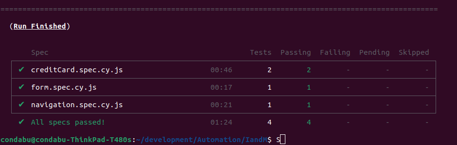

# I-M-QA-Technical

This repository contains a Cypress project for testing https://www.imbankgroup.com/ke/. Below are the instructions for setting up and running the tests on Ubuntu or Windows.

## Prerequisites

Before running the tests, ensure you have the following installed:

- Node.js (version 20.11.1 or higher)
- Git

## Setup

1. Clone the repository:

   ```bash
   git clone https://github.com/charlesmagutu/I-M-QA-Technical.git

   ```
2. Navigate to the project directory:

    ```bash
    cd your-repository
    ```

3. Install dependencies:
    
    ```bash
    npm install
    ```
## Running Tests
#### Using npx cypress run

1. Open a terminal.

2. Navigate to the project directory if not already there:

    ```bash
    cd /path/to/your-repository
    ```
3. Run Cypress tests:

    ```bash
    npx cypress run
    ```
This command will run Cypress tests in headless mode and output the results to the terminal.

#### Using npx cypress open

1. Open a terminal.

2. Navigate to the project directory if not already there:

    ```bash
    cd /path/to/your-repository
    ```
3. Open Cypress Test Runner:

    ```bash
    npx cypress open
    ```
## Test Results

Here's an example of what the test results might look like when running using npx cypress run

